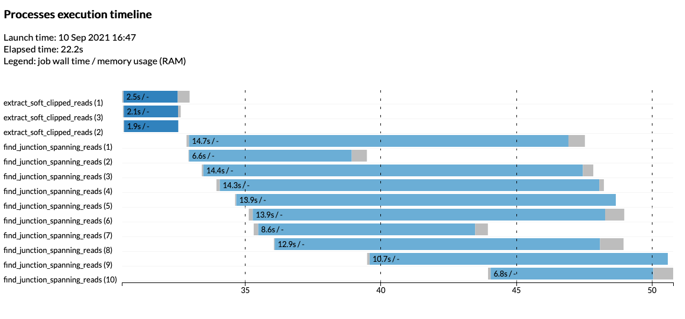

# Nextflow training session

# Part 1 - walk-through of a simple pipeline

## Introduction

The following materials provide a walkthrough of building an analysis workflow
using Nextflow in an stepwise manner introducing new concepts along the way.

The example workflow is taken from an analysis requested by a CRUK-CI research
group and carried out by the Bioinformatics Core earlier this year. In this
session we recreate that workflow and cover some of the key features of the
Nextflow framework.

## Software requirements and installation

The following software packages are required for this walkthrough.

* Java runtime - Java 8 or above
* Nextflow - installation instructions given below
* samtools
* R
* R packages
    * optparse
    * readr
    * dplyr
    * purrr
    * stringr
    * stringi

Versions of samtools, R and the R package dependencies are probably not
important but it's possible that there may be issues with very old versions.

All the required R packages except optparse can be installed in a single step by
installing the complete tidyverse by running the following within an R session:

```
install.packages("tidyverse")
```

## Nextflow installation

Nextflow can be installed at a terminal command prompt as follows and described
on the [Nextflow website](https://www.nextflow.io/).

First check your Java version - should be version 8 or above.

```
java -version
```

Next download and install Nextflow.

```
curl -s https://get.nextflow.io | bash
```

If you don't have `curl` installed download the installation script from the URL
given above within a web browser, then run the script by typing `bash` followed
by the name of the downloaded file.

This should create a Nextflow executable file named `nextflow` in your current
directory.

Finally, test the Nextflow installation was successful by running the following
commands to check the version, list the commands and options available with the
`help` command and running the _Hello World_ example workflow.

```
./nextflow -version
```

```
./nextflow help
```

```
./nextflow run run hello
```

The `nextflow` file should be moved to a directory on your `PATH` so that you
can run Nextflow without having to specify the absolute or relative path to this
file.

## Background for example workflow - cancer genome rearrangement and junction-spanning read identification

The Rosenfeld lab are interested in monitoring the progression of cancers and
recurrence following treatment by analysing the circulating DNA within blood
samples taken from patients and detecting the presence of mutations that were
previously identified from whole genome sequencing of the primary tumour.

Genome rearrangement is a common characteristic of many cancers and one
approach the group have been exploring is to identify translocations from a
structural variant analysis of the primary tumour whole genome sequencing data
and then apply a targeted amplicon-based sequencing approach to identify DNA
fragments within blood samples that span the rearrangement breakpoint. A
breakpoint is the junction between two genomic regions following a
rearrangement. This may be between two regions that are from different
chromosomes or from two parts of the same chromosome that are not expected to
be joined in this way given the reference genome and sequencing data taken
a from a normal/control sample from that patient.

The Rosenfeld group have designed PCR primers for rearrangements that are
uniquely found in the tumour for a given patient within a cohort that will
amplify junction-spanning DNA sequence for subsequent sequencing and analysis.
The extent to which these junction-spanning reads are identified within the
sequencing libraries gives an indication of the progression or recurrence of
the disease.

An R script was written to support this analysis that searches for 20 bases
either side of the junction within read sequences using a fuzzy pattern matching
algorithms that allow for mismatches. The details of this script are not
especially important for this workflow but this script was designed to work on
relatively small amounts of data generated from this targeted sequencing
approach.

A subsequent request to the Bioinformatics Core was to run the same string
matching script on some larger datasets from untargeted whole genome sequencing
of some patient blood samples. This requires significant computational resources
as the fuzzy pattern matching algorithm is too slow to be run over very large
numbers of sequence reads. Fortunately, the sequencing data were already aligned
and the task could be made more manageable by first extracting the subset of
reads that have soft-clipped alignments. The reasoning here is that
junction-spanning reads will not align across their entire length to the
reference genome and so will have clipped alignments and possibly supplementary
alignments. The workflow that was created extracts the soft-clipped reads from
the input BAM file(s) where a sufficient portion of a read that has been
clipped, then splits the resulting FASTQ file into chunks to parallelize the
pattern matching.

### Junction detection script and test data

The R script for detecting junction-spanning reads and some test sequence data
files are available
[here](https://content.cruk.cam.ac.uk/bioinformatics/CourseData/NextflowSeptember2021/junction_detection.tar).

Download and unpack tarball.

```
wget https://content.cruk.cam.ac.uk/bioinformatics/CourseData/NextflowSeptember2021/junction_detection.tar
tar xf junction_detection.tar
```

The extracted junction_detection directory contains `bam`, `resources` and
`scripts` subdirectories and provides a convenient working directory for the
rest of this walk-through.

```
cd junction_detection
```

### Step 1: Extract soft-clipped reads

The first step in the process is to extract the sequence reads with soft-clipped
alignments. We will simplify matters by applying a simple `awk` command to
filter records within an input BAM file with a CIGAR string containing an 'S'
character, indicating that the alignment has been soft clipped. The filtering
used in the production pipeline was more discerning taking into account that the
following step searches for 20 nucleotide flanking sequences either side of the
breakpoint and that shorter clipped regions will not yield matches.

Here is the command for the first step:

```
samtools view -h -F2048 bam/ERR194147.1.bam \
  | awk '$0 ~ /^@/ || $6 ~ /S/' \
  | samtools fastq -N -o softclipped.fq.gz
```

`samtools` is used to read the BAM file and pass records to `awk` in tabular SAM
format. Supplementary alignments are excluded using the `-F2048` argument to
`samtools view`.

The `awk` filter retains header lines beginning with '@' and those with a CIGAR
string in the sixth column containing the 'S' symbol for soft clipping.

Finally `samtools` is used again to convert the filtered SAM records into FASTQ.

### Step 2: Identify junction-spanning reads

The second step involves running the R script that runs fuzzy string matching
for a set of SV junctions using flanking sequences either side of the breakpoint.
These flanking sequences are contained in an CSV file. The script is run as
follows:

```
./scripts/find_junction_spanning_sequences.R \
  --fastq=softclipped.fq.gz \
  --flanking-sequences=resources/flanking_sequences.csv \
  --output=matches.tsv
```

There is only one match in the BAM file `ERR194147.1.bam`
for one of the five junctions in our search.

## Nextflow processes and channels

A Nextflow workflow is composed of a set of processes that are joined together
through channels.

**Processes** can be written in any scripting language that can be run within a
bash shell, e.g. Python, Perl, Ruby, including and most commonly bash itself.
These scripts will usually call tools such as *bwa* or *samtools* or other
more involved scripts such as the R script in our use case.

**Channels** are essentially FIFO queues. A process can define one or more
channels as its input and output.

A workflow can be thought of as a graph in which the nodes are processes and
the edges connecting nodes are channels.

## Initial Nextflow script

We'll start by creating a channel for our input BAM file in a new Nextflow
script named `junction_detection.nf`.

```
// junction_detection.nf

nextflow.enable.dsl=2

bam_channel = Channel.fromPath("bam/ERR194147.1.bam")

bam_channel.view()
```

Nextflow scripts are written using a domain-specific language (DSL) that is an
extension of the Groovy scripting language, which in turn is a superset of the
Java programming language. The first line is a comment using the '//' notation
that will be familiar if you've coded in Java. Nextflow introduced a new version
of the DSL in July 2020. Use of DSL2 is strongly recommended and needs to be
declared as shown in the above script.

We use the `Channel.fromPath()` function to create a channel for just a single
BAM file at this stage.

The contents of a channel can be displayed with the `view()` function, which is
useful when developing or debugging a pipeline.

Run the script as follows:

```
nextflow run junction_detection.nf
```

The output you should see will look something like this:

```
N E X T F L O W  ~  version 20.10.0
Launching `junction_detection.nf` [angry_khorana] - revision: 58a8f77e6a
/Users/eldrid01/training/nextflow/sv_junction_detection/bam/ERR194147.1.bam
```

Note that a `work` directory was created but that it is empty since no actual
work was done. For that we need to create a process.

> _**Exercise**_
>
> * Change the file pattern to use a wildcard, i.e. `bam/ERR194147.*.bam` and re-run.

Revert back to a single BAM file and add an additional argument to the
`Channel.fromPath()` function to check if the file exists.

```
// junction_detection.nf

nextflow.enable.dsl=2

bam_channel = Channel.fromPath("bam/ERR194147.1.bam", checkIfExists: true)
bam_channel.view()
```

> _**Exercise**_
>
> * Change the BAM file path to a non-existent file and re-run the script.

## Separate workflow installation directory

Our Nextflow script is in our current working directory, i.e. a run directory.

It is good practice to develop and maintain the workflow within its own separate
installation directory some place else on the file system, e.g. an area where
other tools and pipelines under development are installed.

For this session we'll create a subdirectory under our current directory.

```
mkdir junction_detection_pipeline
mv junction_detection.nf junction_detection_pipeline
```

Re-run the pipeline specifying the path to the `nf` file (relative or absolute)
to check everything is still working.

```
nextflow run junction_detection_pipeline/junction_detection.nf
```

## Process for step 1

We'll add a `process` block for the first of the two steps in our workflow.

```
// junction_detection.nf

nextflow.enable.dsl=2

process extract_soft_clipped_reads {

    input:
        path bam

    output:
        path "softclipped.fq.gz"

    script:
        """
        samtools view -h -F2048 ${bam} \
          | awk '$0 ~ /^@/ || $6 ~ /S/' \
          | samtools fastq -N -o softclipped.fq.gz
        """
}

workflow {

    bam_channel = Channel.fromPath("bam/ERR194147.1.bam", checkIfExists: true)

    extract_soft_clipped_reads(bam_channel)
}
```

The script above also adds a `workflow` block and connects the BAM channel to
this. This feeds a BAM file or files to the new `extract_soft_clipped_reads`
process as an input named `bam`.

The script block is written as a multi-line string defined by three
double-quote characters. Using double quotes allows for variable substitution,
in much the same way as is common in bash scripts. Note the BAM input file path
is substituted using `${bam}`.

> _**Exercise**_
>
> * Run the above version of our workflow and look at the error that's reported
>
> * Can you work out why it fails and how to fix this?
> > * *Hint: you will need to escape the dollar symbols that are not being used for Nextflow variables (use backslash)*
>
> * Check the work directory after it has been run successfully
>
> * Look at the directories and files that have been created and try to understand how Nextflow sets up and runs the process
> > * *Hint: look for hidden files*
>
> * Examine the hidden log file named `.nextflow.log`
>
> * What can you tell about how Nextflow is managing resources on your computer?
>
> * Re-run the workflow and see what's changed - have any new files been created?
>
> * Clean out the work directories, log files and cache
>
> ```
> rm -rf work .nextflow*
> ```
>
> * Change the file path for the BAM channel to run over all BAM files in the `bam` directory
>
> * What do expect will happen when re-running the workflow?
>
> * Re-run and check if you're correct

## Obtaining unique IDs from file names

Our workflow currently outputs FASTQ files named `softclipped.fq.gz` for each
input BAM file, albeit in different work directories. We would normally prefer
to have output files that are named in a way that reflects some identifier for
the input dataset. One way of achieving this is to extract the ID from the input
file name, for example using the base name, i.e. excluding the `.bam` suffix.

We can use the `getBaseName()` function on the BAM file path and then construct
a more sensible name for our FASTQ file as shown in the following snippet:

```
prefix = bam.getBaseName()
fastq = "${prefix}.fq.gz"
```

The snippet can be placed within the script block in our process definition:

```
// junction_detection.nf

nextflow.enable.dsl=2

process extract_soft_clipped_reads {

    input:
        path bam

    output:
        path fastq

    script:
        prefix = bam.getBaseName()
        fastq = "${prefix}.fq.gz"
        """
        samtools view -h -F2048 ${bam} \
          | awk '\$0 ~ /^@/ || \$6 ~ /S/' \
          | samtools fastq -N -o ${fastq}
        """
}

workflow {

    bam_channel = Channel.fromPath("bam/ERR194147.*.bam", checkIfExists: true)

    extract_soft_clipped_reads(bam_channel)
}
```

## Configuration parameters

The hard-coded BAM file path is not ideal. Each time we want to run the pipeline
on a new set of input BAM files, we'd need to change the workflow file. Instead
this should be a parameter that can be configured for each run.

Change the BAM channel so it uses a parameter named `bam_files` as follows.

```
// junction_detection.nf

// ...

workflow {

    bam_channel = Channel.fromPath(params.bam_files, checkIfExists: true)

    extract_soft_clipped_reads(bam_channel)
}
```

On re-running the workflow, we get the following warning about an undefined
parameter.

```
nextflow run junction_detection_pipeline/junction_detection.nf

N E X T F L O W  ~  version 20.10.0
Launching `junction_detection_pipeline/junction_detection.nf` [backstabbing_noether] - revision: 71d8a55555
WARN: Access to undefined parameter `bam_files` -- Initialise it to a default value eg. `params.bam_files = some_value`
Missing `fromPath` parameter
```

One way to specify parameters is to add these as arguments at the end of the
`nextflow run` invocation.

```
nextflow run junction_detection_pipeline/junction_detection.nf --bam_files="bam/*.bam"
```

Pipelines typically have several configuration parameters and specifying each on
command line can be cumbersome. A configuration file may be preferred in that
case.

Create a configuration file named `junction_detection.config` in your working
directory containing the following `params` block.

```
// junction_detection.config

params {
    bam_files = "bam/ERR194147.*.bam"
}
```

Re-run the pipeline specifying the configuration file using the `-c` option.

```
nextflow run -c junction_detection.config junction_detection_pipeline/junction_detection.nf
```

## Process for step 2

A workflow with just one process isn't much of a workflow so we'll now add a
process definition for the second step, the R script that finds
junction-spanning reads using fuzzy string matching of the flanking sequences
either side of breakpoints.

The new version of our workflow also creates a channel for the flanking
sequences CSV file and joins the output from the first process to the input
of the new process.

```
// junction_detection.nf

nextflow.enable.dsl=2

process extract_soft_clipped_reads {

    input:
        path bam

    output:
        path fastq

    script:
        prefix = bam.getBaseName()
        fastq = "${prefix}.fq.gz"
        """
        samtools view -h -F2048 ${bam} \
          | awk '\$0 ~ /^@/ || \$6 ~ /S/' \
          | samtools fastq -N -o ${fastq}
        """
}

process find_junction_spanning_reads {

    input:
        path fastq
        path flanking_sequences

    output:
        path matches

    script:
        prefix = fastq.getBaseName(2)
        matches = "${prefix}.tsv"
        """
        find_junction_spanning_sequences.R \
          --id=${prefix} \
          --fastq=${fastq} \
          --flanking-sequences=${flanking_sequences} \
          --output=${matches}
        """
}

workflow {

    bam_channel = Channel.fromPath(params.bam_files, checkIfExists: true)

    flanking_sequences = Channel.fromPath(params.flanking_sequences, checkIfExists: true)

    // assign output channel for soft-clipped FASTQ files
    fastq = extract_soft_clipped_reads(bam_channel)

    // pass FASTQ files into new process
    find_junction_spanning_reads(fastq, flanking_sequences)
}
```

The new flanking_sequences parameter must be added to the configuration file.
```
// junction_detection.config

params {
    bam_files = "bam/ERR194147.*.bam"
    flanking_sequences = "resources/flanking_sequences.csv"
}
```

The `find_junction_spanning_sequences.R` must be available on the PATH for the
script block to run. Nextflow automatically adds a `bin` directory if it exists
in the pipeline installation directory alongside the main Nextflow workflow
`.nf` file.

Create the bin directory and copy the R script to it.

```
mkdir junction_detection_pipeline/bin
cp scripts/find_junction_spanning_sequences.R junction_detection_pipeline/bin
```

> _**Exercise**_
>
> * Run the updated pipeline and check what processes are run and what outputs are produced
>
> * The fastq and flanking_sequences channels are not combined correctly - can you spot the problem?

## Combining outputs from two channels

The issue with the pipeline as written is that the `flanking_sequences` channel
only has one file and this is paired with just one of the output FASTQ files
from the `fastq` channel. The `find_junction_spanning_reads` process is only run
once because all items in the `flanking_sequences` have been consumed. The
remaining FASTQ files in the `fastq` file are left dangling with no flanking
sequences to pair with.

This might seem counterintuitive. Understanding how channels work as queues and
how processes consume the items in each channel is fundamental to being able to
write Nextflow pipelines. The section on Operators in the Nextflow documentation
is well worth reading and contains lots of mini examples that illustrate the
many ways in which it is possible to work with and manipulate channels.

The `combine` operator is what we need in this case. It combines the items
emitted by two channels resulting in each pairwise combination.

We'll comment out the problematic second step and instead combine the output
from the first step, the `fastq` channel, with the `flanking_sequences` channel
and view the result.

```
// junction_detection.nf

// ...

workflow {

    bam_channel = Channel.fromPath(params.bam_files, checkIfExists: true)

    flanking_sequences = Channel.fromPath(params.flanking_sequences, checkIfExists: true)

    // assign output channel for soft-clipped FASTQ files
    fastq = extract_soft_clipped_reads(bam_channel)

    // pass FASTQ files into new process
    // find_junction_spanning_reads(fastq, flanking_sequences)

    fastq.combine(flanking_sequences).view()
}
```

Re-running the workflow should result in something like the following output:

```
nextflow run -c junction_detection.config junction_detection_pipeline/junction_detection.nf

N E X T F L O W  ~  version 20.10.0
Launching `junction_detection_pipeline/junction_detection.nf` [modest_fourier] - revision: ee26729252
executor >  local (3)
[82/ff7d7f] process > extract_soft_clipped_reads (3) [100%] 3 of 3 ✔
[/Users/eldrid01/training/nextflow/junction_detection/work/49/2570d490fbf777b2c25ac6c5f6217b/ERR194147.2.fq.gz, /Users/eldrid01/training/nextflow/junction_detection/resources/flanking_sequences.csv]
[/Users/eldrid01/training/nextflow/junction_detection/work/09/917fbcf565cdfdd9297b162379442d/ERR194147.3.fq.gz, /Users/eldrid01/training/nextflow/junction_detection/resources/flanking_sequences.csv]
[/Users/eldrid01/training/nextflow/junction_detection/work/82/ff7d7f8b74786c288cd57b4db368fc/ERR194147.1.fq.gz, /Users/eldrid01/training/nextflow/junction_detection/resources/flanking_sequences.csv]
```

The `combine` operation results in a channel in which 2-element lists are
created. One element in the list is the FASTQ file from the `fastq` channel and
the other is the `flanking_sequences.csv` file.

We can now pass this to the second process but now we only have a single input,
a 2-element tuple.

The updated workflow is shown below.

```
// junction_detection.nf

nextflow.enable.dsl=2

process extract_soft_clipped_reads {

    input:
        path bam

    output:
        path fastq

    script:
        prefix = bam.getBaseName()
        fastq = "${prefix}.fq.gz"
        """
        samtools view -h -F2048 ${bam} \
          | awk '\$0 ~ /^@/ || \$6 ~ /S/' \
          | samtools fastq -N -o ${fastq}
        """
}

process find_junction_spanning_reads {

    input:
        tuple path(fastq), path(flanking_sequences)

    output:
        path matches

    script:
        prefix = fastq.getBaseName(2)
        matches = "${prefix}.tsv"
        """
        find_junction_spanning_sequences.R \
          --id=${prefix} \
          --fastq=${fastq} \
          --flanking-sequences=${flanking_sequences} \
          --output=${matches}
        """
}

workflow {

    bam_channel = Channel.fromPath(params.bam_files, checkIfExists: true)

    flanking_sequences = Channel.fromPath(params.flanking_sequences, checkIfExists: true)

    // assign output channel for soft-clipped FASTQ files
    fastq = extract_soft_clipped_reads(bam_channel)

    fastq_and_flanking_sequences = fastq.combine(flanking_sequences)

    find_junction_spanning_reads(fastq_and_flanking_sequences)
}
```

## Using pipes

Pipes can help to simplify the workflow and make it more readable. The following
workflow block is equivalent to what we have above in which each channel is
assigned to a variable. Pipes remove the need for those intermediate variables.

```
// junction_detection.nf

/// ...

workflow {

    bam = Channel.fromPath(params.bam_files, checkIfExists: true)

    flanking_sequences = Channel.fromPath(params.flanking_sequences, checkIfExists: true)

    bam \
      | extract_soft_clipped_reads \
      | combine(flanking_sequences) \
      | find_junction_spanning_reads
}
```

## Publishing results

The `publishDir` directive allows for the outputs from a process to be published
to a specified directory. This is convenient for those output files that are not
intermediate files but are needed as final output files.

```
// junction_detection.nf

/// ...

process find_junction_spanning_reads {

    publishDir "${params.results_dir}", mode: "copy"

    input:
        tuple path(fastq), path(flanking_sequences)

    output:
        path matches

    script:
        prefix = fastq.getBaseName(2)
        matches = "${prefix}.tsv"
        """
        find_junction_spanning_sequences.R \
          --id=${prefix} \
          --fastq=${fastq} \
          --flanking-sequences=${flanking_sequences} \
          --output=${matches} \
          --max-distance=${params.max_distance}
        """
}

// ...
```

```
// junction_detection.config

params {
    bam_files          = "bam/ERR194147.*.bam"
    flanking_sequences = "resources/flanking_sequences.csv"
    results_dir        = "results"
}
```

## Collecting results

The `collectFile` operator is very useful for collecting the outputs from a
channel and saving them to a single file.

We'll remove the `publishDir` directive introduced in the previous section,
along with the `results_dir` parameter, and replace these with a single
concatenated results file.

```
// junction_detection.nf

/// ...

workflow {

    bam = Channel.fromPath(params.bam_files, checkIfExists: true)

    flanking_sequences = Channel.fromPath(params.flanking_sequences, checkIfExists: true)

    bam \
      | extract_soft_clipped_reads \
      | combine(flanking_sequences) \
      | find_junction_spanning_reads \
      | collectFile(name: params.results, keepHeader: true")
}
```

```
// junction_detection.config

params {
    bam_files          = "bam/ERR194147.*.bam"
    flanking_sequences = "resources/flanking_sequences.csv"
    results            = "results/flanking_sequence_matches.tsv"
}
```

## Resuming a pipeline run using cached results

Nextflow keeps track of all the processes executed by a pipeline. If a part of
the pipeline is modified, only the processes that have been changed and any
afftected downstream processes will be re-executed if the pipeline is run with
the `-resume` option.

The execution of the processes that are unaffected will be skipped and the
cached results used instead.

We'll introduce another parameter, `max_distance`, the maximum distance allowed
in matching flanking sequences, to show this in action.

```
// junction_detection.nf

// ...

process find_junction_spanning_reads {

    input:
        tuple path(fastq), path(flanking_sequences)

    output:
        path matches

    script:
        prefix = fastq.getBaseName(2)
        matches = "${prefix}.tsv"
        """
        find_junction_spanning_sequences.R \
          --id=${prefix} \
          --fastq=${fastq} \
          --flanking-sequences=${flanking_sequences} \
          --output=${matches} \
          --max-distance=${params.max_distance}
        """
}

// ...
```

```
// junction_detection.config

params {
    bam_files          = "bam/ERR194147.*.bam"
    flanking_sequences = "resources/flanking_sequences.csv"
    results            = "results/flanking_sequence_matches.tsv"
    max_distance       = 2
}
```

On re-running the workflow with `-resume` we can see that the cached results
from the first, unchanged process are used as there is no need to re-run that
step.

```
nextflow run -c junction_detection.config -resume junction_detection_pipeline/junction_detection.nf

N E X T F L O W  ~  version 20.10.0
Launching `junction_detection_pipeline/junction_detection.nf` [small_hawking] - revision: 74847a471f
executor >  local (3)
[30/0e7fa5] process > extract_soft_clipped_reads (3)   [100%] 3 of 3, cached: 3 ✔
[70/9b08ad] process > find_junction_spanning_reads (3) [100%] 3 of 3 ✔
```

> _**Exercise**_
>
> * Explore the hidden `.nextflow` directory and the history file and cache directories contained within this

## Pipeline reports

Nextflow has excellent tools for generating an execution report and a timeline
summarizing the processes run by a pipeline and the resources required.

Use the `-with-report` and `-with-timeline` options to generate these reports.

```
nextflow run \
  -c junction_detection.config \
  junction_detection_pipeline/junction_detection.nf \
  -with-report reports/report.html \
  -with-timeline reports/timeline.html
```

*Note*

Nextflow is unable to obtain runtime metrics on Mac OS unless the processes are
run using a Docker or Singularity container (beyond the scope of this session).
This means that the execution report will not contain some of the more useful
information about resource usage.

> _**Exercise**_
>
> * Take a look at the HTML reports and what details these provide
>
> * Create an error in the R script that results in a failure, re-run the pipeline and see how this is reported both in the log file and the execution report
>
> * If you're using a Mac, try re-running the pipeline on a Linux server to see the more complete execution report

## Built-in splitting and parallelization

Nextflow has some built-in splitting operations that can be used to split items
or output files from a channel into chunks for parallelization of downstream
processes.

We can use the `splitFastq` operator to split the FASTQ output files from the
first step in our workflow into chunks of a specified size. The flanking
sequence match is then run on each of these smaller chunks and the results
collated as before. The advantage is that we can run many smaller jobs in
parallel, potentially distributing the processing workload over many more CPUs
(especially on a cluster) and reducing the overall elapsed time.

A single additional step in our piped workflow is all that's needed and a new
configuration parameter for the chunk size.

```
// junction_detection.nf

// ...

workflow {

    bam = Channel.fromPath(params.bam_files, checkIfExists: true)

    flanking_sequences = Channel.fromPath(params.flanking_sequences, checkIfExists: true)

    bam \
      | extract_soft_clipped_reads \
      | splitFastq(by: params.chunk_size, file: true, compress: true) \
      | combine(flanking_sequences) \
      | find_junction_spanning_reads \
      | collectFile(name: params.results, keepHeader: true)
}
```

```
// junction_detection.config

params {
    bam_files          = "bam/ERR194147.*.bam"
    flanking_sequences = "resources/flanking_sequences.csv"
    results            = "results/flanking_sequence_matches.tsv"
    max_distance       = 2
    chunk_size         = 10000
}
```

Re-running the pipeline shows that we've split the three
`find_junction_spanning_reads` processes into 10 jobs.

```
nextflow run \
  -c junction_detection.config \
  junction_detection_pipeline/junction_detection.nf \
  -with-report report.html \
  -with-timeline timeline.html

N E X T F L O W  ~  version 20.10.0
Launching `junction_detection_pipeline/junction_detection.nf` [romantic_dijkstra] - revision: 821845dd01
executor >  local (13)
[77/f16c72] process > extract_soft_clipped_reads (3)    [100%] 3 of 3 ✔
[c9/72a5a8] process > find_junction_spanning_reads (10) [100%] 10 of 10 ✔
```

> _**Exercise**_
>
> * Compare the timeline reports before and after this chunking optimization

Having split our `find_junction_spanning_reads` task into chunks we might want
combine the outputs for each of the datasets separately rather than
concatenating all the outputs as our current `collectFile` operation does. If
we don't specify a file when calling `collectFile`, outputs with the same name
are grouped together.

We'll reinstate the `results_dir` parameter and use this to set the `storeDir`
argument to `collectFile`.

```
// junction_detection.nf

// ...

workflow {

    bam = Channel.fromPath(params.bam_files, checkIfExists: true)

    flanking_sequences = Channel.fromPath(params.flanking_sequences, checkIfExists: true)

    bam \
      | extract_soft_clipped_reads \
      | splitFastq(by: params.chunk_size, file: true, compress: true) \
      | combine(flanking_sequences) \
      | find_junction_spanning_reads \
      | collectFile(keepHeader: true, storeDir: params.results_dir)
}
```

```
// junction_detection.config

params {
    bam_files          = "bam/ERR194147.*.bam"
    flanking_sequences = "resources/flanking_sequences.csv"
    results_dir        = "results"
    max_distance       = 2
    chunk_size         = 10000
}
```

> _**Exercise**_
>
> * Update the pipeline with the change to the `collectFile` operation, re-run and look at difference in the results files that are created

## Using a sample sheet

In its current form the workflow uses sample or dataset identifiers taken from
the input BAM file names and assumes that all input BAM files are named in this
way. This could become inconvenient if a new set of BAM files is supplied that
are named in a completely different way, e.g. constructed from flow cell, pool
and barcode IDs instead.

Using a sample sheet that maps BAM files to sample names or identifiers is an
alternative and arguably better solution and Nextflow has built-in functions for
reading the rows from a CSV file into a channel.

Instead of taking the prefix of the BAM file we'll use an ID from a CSV file
that contains two columns: `id` and `bam`.

Create a sample sheet CSV file named `sample_sheet.csv` with the following
contents:

```
id,bam
ERR194147_1,bam/ERR194147.1.bam
ERR194147_2,bam/ERR194147.2.bam
ERR194147_3,bam/ERR194147.3.bam
```

We're going to try to create a channel that contains tuples of 2 elements,
pairing the ID and the BAM file path. We'll then modify our workflow, changing
the inputs for each of the processes and removing the Groovy code for obtaining
the ID from the input file name.

Experimenting with channel operations is sometimes easier done in a separate
test Nextflow script. We'll do this now and then when we're happy with the
result we'll migrate it into our existing workflow.

Create a new `test.nf` file in your working directory, i.e. the run directory,
not the pipeline installation folder, and add the following line to create a
channel for the sample sheet CSV file.

```
// test.nf
sample_sheet = Channel.fromPath("sample_sheet.csv")
sample_sheet.view()
```

We're not so concerned about hard-coded file names at this stage of prototyping
and will parameterize this later when incorporating the new code into our main
workflow.

We're going to use Nextflow's `splitCsv` operator and look at the results using
the `view` operator. Let's try it first with no arguments.

```
// test.nf
sample_sheet = Channel.fromPath("sample_sheet.csv")

sample_sheet.splitCsv().view()
```

Running this should give something like the following output:

```
nextflow run test.nf

N E X T F L O W  ~  version 20.10.0
Launching `test.nf` [hopeful_kimura] - revision: ef60f1a82f
[id, bam]
[ERR194147, bam/ERR194147.1.bam]
[ERR194147, bam/ERR194147.2.bam]
[ERR194147, bam/ERR194147.3.bam]
```

Each item in the channel produced by `splitCsv` is a list of 2 items. The header
is included as the first such list, which we don't really want. A look at the
Nextflow documentation shows that there are a number of parameters we can supply
to `splitCsv` including the `header` parameter.

```
// test.nf
sample_sheet = Channel.fromPath("sample_sheet.csv")

sample_sheet
    .splitCsv(header:true)
    .view()
```

```
nextflow run test.nf

N E X T F L O W  ~  version 20.10.0
Launching `test.nf` [fabulous_curran] - revision: fe2850f108
[id:ERR194147_1, bam:bam/ERR194147.1.bam]
[id:ERR194147_2, bam:bam/ERR194147.2.bam]
[id:ERR194147_3, bam:bam/ERR194147.3.bam]
```

The output is now a set of *map* items. These are also known as dictionaries or
associative arrays and allow for each element to be referred to by name where
the name is the column heading. This will be useful if we need to select just
some of the columns or change their order.

We're going to use the `map` operator and a *closure*. A closure is a block of
code that can be passed as an argument to a function. You can read more about
features of the Groovy language such as variables, lists, maps and closures in
the *Nextflow scripting* section of the Nextflow documentation.

```
// test.nf
sample_sheet = Channel.fromPath("sample_sheet.csv")

sample_sheet
    .splitCsv(header:true)
    .map { row -> tuple(row.id, row.bam) }
    .view()
```

```
nextflow run test.nf

N E X T F L O W  ~  version 20.10.0
Launching `test.nf` [kickass_gilbert] - revision: b62b3cd0eb
[ERR194147_1, bam/ERR194147.1.bam]
[ERR194147_2, bam/ERR194147.2.bam]
[ERR194147_3, bam/ERR194147.3.bam]
```

One last thing we should do is to create a file object for each of the BAM files
and at the same time check that they exist.

```
// test.nf
sample_sheet = Channel.fromPath("sample_sheet.csv")

sample_sheet
    .splitCsv(header:true)
    .map { row -> tuple(row.id, file(row.bam, checkIfExists: true)) }
    .view()
```

```
nextflow run test.nf

N E X T F L O W  ~  version 20.10.0
Launching `test.nf` [nostalgic_brown] - revision: 10e7649575
[ERR194147_1, /Users/eldrid01/training/nextflow/nextflow_september_2021/junction_detection/bam/ERR194147.1.bam]
[ERR194147_2, /Users/eldrid01/training/nextflow/nextflow_september_2021/junction_detection/bam/ERR194147.2.bam]
[ERR194147_3, /Users/eldrid01/training/nextflow/nextflow_september_2021/junction_detection/bam/ERR194147.3.bam]
```

We're now ready to update our main workflow to read BAM files it works on from
a sample sheet. Here is the updated version.

```
// junction_detection.nf

nextflow.enable.dsl=2

process extract_soft_clipped_reads {

    input:
        tuple val(id), path(bam)

    output:
        tuple val(id), path(fastq)

    script:
        fastq = "${id}.fq.gz"
        """
        samtools view -h -F2048 ${bam} \
          | awk '\$0 ~ /^@/ || \$6 ~ /S/' \
          | samtools fastq -N -o ${fastq}
        """
}

process find_junction_spanning_reads {

    input:
        tuple val(id), path(fastq), path(flanking_sequences)

    output:
        path matches

    script:
        matches = "${id}.tsv"
        """
        find_junction_spanning_sequences.R \
          --id=${id} \
          --fastq=${fastq} \
          --flanking-sequences=${flanking_sequences} \
          --output=${matches} \
          --max-distance=${params.max_distance}
        """
}

workflow {

    sample_sheet = Channel.fromPath(params.sample_sheet, checkIfExists: true)

    bam = sample_sheet
        .splitCsv(header:true)
        .map { row -> tuple(row.id, file(row.bam, checkIfExists: true)) }

    flanking_sequences = Channel.fromPath(params.flanking_sequences, checkIfExists: true)

    bam \
      | extract_soft_clipped_reads \
      | splitFastq(by: params.chunk_size, file: true, compress: true) \
      | combine(flanking_sequences) \
      | find_junction_spanning_reads \
      | collectFile(keepHeader: true, storeDir: params.results_dir)
}
```

Note that the ID for each dataset (BAM file) is provided to the processes as
part of a tuple input. The sample sheet is a configurable parameter that
replaces the `bam_files` parameter we used previously.

```
// junction_detection.config

params {
    sample_sheet       = "sample_sheet.csv"
    flanking_sequences = "resources/flanking_sequences.csv"
    results_dir        = "results"
    max_distance       = 1
    chunk_size         = 10000
}
```

Using a sample sheet gives us greater flexibility. In the real-life project in
which this workflow was originally developed, the sequencing was spread across
multiple flow cells and there were multiple input BAM files for each sample or
dataset as there was a separate BAM file for each lane on which that sample was
sequenced. The processing was run for each BAM file separately but the same ID
could be used for more than one BAM file in the workflow so the results could be
gathered for each sample very straightforwardly.

> _**Exercise**_
>
> * Modify the sample sheet so that all three BAM files come from the same sample, i.e. share the same ID, re-run and check that the pipeline does what you expect it to
>
> * Repeat with two BAM files mapped to one sample and the third coming from a different sample

## Managing resources

The `.nextflow.log` log file produced by Nextflow contains some information
about the way it is managing resources when determining what jobs to run and
when to run them.

The following lines are an excerpt from the log file created on running the
workflow on a MacBook laptop.

```
Sep-10 16:47:29.151 [main] DEBUG nextflow.Session - Executor pool size: 8
Sep-10 16:47:29.190 [main] DEBUG nextflow.cli.CmdRun -
  Version: 20.10.0 build 5430
  Created: 01-11-2020 15:14 UTC (15:14 BST)
  System: Mac OS X 10.16
  Runtime: Groovy 3.0.5 on OpenJDK 64-Bit Server VM 11.0.10+9
  Encoding: UTF-8 (UTF-8)
  Process: 25082@C02DKBL4P3XY [10.20.80.185]
  CPUs: 8 - Mem: 8 GB (950 MB) - Swap: 1 GB (492.8 MB)
```

Nextflow has determined that the computer has 8 CPUs and a total of 8 GB of
memory.

The timeline report for this run shows that it only ran 8 of the
`find_junction_spanning_reads` processes at any one time with 2 of the 10 jobs
waiting until others had completed.



Nextflow has assumed that each process requires a single CPU and has limited
the number of concurrent jobs accordingly.

We can limit the number of CPUs that Nextflow uses by setting the `cpus`
parameter in the `junction_detection.config` configuration file as follows.

```
// junction_detection.config

params {
    sample_sheet       = "sample_sheet.csv"
    flanking_sequences = "resources/flanking_sequences.csv"
    results_dir        = "results"
    max_distance       = 1
    chunk_size         = 10000
}

executor {
    name = "local"
    cpus = 4
}
```

We added a new block for the 'local' executor. In the Nextflow framework
architecture, the executor is the component that determines the system where a
pipeline process is run and supervises its execution. The local executor is used
by default and runs processes on the computer where Nextflow is launched.

> _**Exercise**_
>
> * Re-run the pipeline with the additional *executor* configuration given above and look at the timeline report
>
> * What change do you see in the way in the way in which Nextflow has run the jobs?

The other aspect of a job we may want to exercise some control over is its
memory requirement. Let's say we expect the `find_junction_spanning_reads`
process to require 2 GB we can specify that using a `memory` directive in the
process definition within the workflow.

```
// junction_detection.nf

// ...

process find_junction_spanning_reads {

    memory "2 GB"

    input:
        tuple val(id), path(fastq), path(flanking_sequences)

    output:
        path matches

    script:
        matches = "${id}.tsv"
        """
        find_junction_spanning_sequences.R \
          --id=${id} \
          --fastq=${fastq} \
          --flanking-sequences=${flanking_sequences} \
          --output=${matches} \
          --max-distance=${params.max_distance}
        """
}

// ...
```

Similarly we would specify the number of CPUs the process would require if this
was more than one.

We can provide default CPU and memory settings for all processes in our workflow
by adding a process block in our configuration file.

```
// junction_detection.config

// ...

process {
    cpus = 1
    memory = "1 GB"
}

executor {
    name = "local"
    cpus = 4
    memory = "6 GB"
}
```

In this case all processes are allocated a single CPU and 1 GB of memory by
default unless these settings are overridden as we did for the
`find_junction_spanning_reads` process, which was allocated 2 GB.

We have also limited the total amount of memory that the workflow can use by
setting the `memory` parameter for the local executor.

> _**Exercise**_
>
> * Re-run the pipeline with the updated CPU and memory settings and look at the timeline report
>
> * Has Nextflow limited the number of jobs run in parallel in the way you expect?

## Profiles

We may want to have different resource settings for different computers on which
we will run our pipeline. This can be managed using profiles.

We'll create two profiles: a standard profile that we'll use when developing the
workflow on a desktop or laptop computer and another profile named 'bigserver'
that we'll use for deploying the workflow on a much larger server computer.

```
// junction_detection.config

// ...

process {
    cpus = 1
    memory = "1 GB"
}

profiles {
    standard {
        process.executor = "local"
        executor {
            cpus = 4
            memory = "6 GB"
        }
    }

    bigserver {
        process.executor = "local"
        executor {
            cpus = 30
            memory = "128 GB"
        }
    }
}
```

The configuration file features a `profiles` block in place of the `executor`
block we had previously. Each of the two profiles defined, `standard` and
`bigserver` have their own `executor` block and specify that the local executor
is to be used.

The `standard` profile is run by default but the pipeline can be launched with a
different profile by using the `-profile` command-line option.

```
nextflow run \
  -c junction_detection.config \
  junction_detection_pipeline/junction_detection.nf \
  -profile bigserver \
  -with-timeline reports/timeline.html
```

## Default configuration settings

Nextflow obtains its configuration from a number of files in multiple locations
as well as allowing for parameters to be set as command-line arguments as we saw
earlier.

There is an order of precedence of the various locations so settings found in
one file may be overridden by the same parameters set in a different file. The
Nextflow documentation explains this clearly.

The default process resource settings and the profiles we created in the
previous two sections are better placed in a pipeline configuration file within
the workflow installation directory rather than the configuration file we've
been using that resides in a run folder.

We can create a configuration file named `nextflow.config` in the pipeline
installation directory, i.e. the same directory that is home to our workflow
file (`junction_detection.nf`). This could even contain default settings for
our parameters.

```
// nextflow.config

params {
    sample_sheet       = "sample_sheet.csv"
    flanking_sequences = "flanking_sequences.csv"
    results_dir        = "results"
    max_distance       = 2
    chunk_size         = 1000000
}

process {
    cpus = 1
    memory = "1 GB"
}

profiles {
    standard {
        process.executor = "local"
        executor {
            cpus = 4
            memory = "6 GB"
        }
    }

    bigserver {
        process.executor = "local"
        executor {
            cpus = 30
            memory = "128 GB"
        }
    }
}
```

Our run directory configuration file is simplified as it will no longer need
most of the configuration settings but will override some of the settings
specific to our particular run.

```
// junction_detection.config

params {
    sample_sheet       = "sample_sheet.csv"
    flanking_sequences = "resources/flanking_sequences.csv"
    results_dir        = "results"
    max_distance       = 1
    chunk_size         = 10000
}
```

## Running on a cluster

TODO
